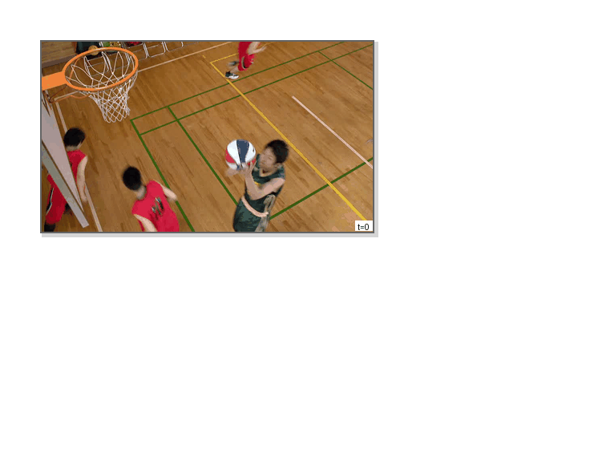
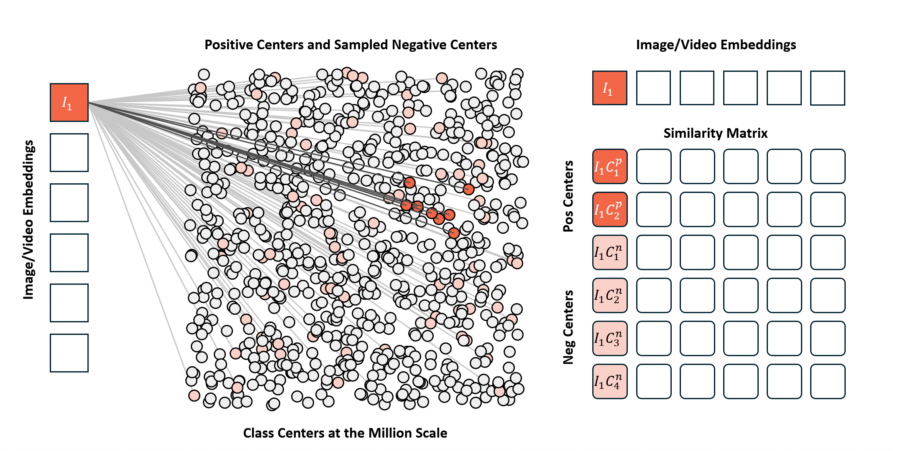

<p align="center">
  <picture>
    <source media="(prefers-color-scheme: dark)" srcset="asset/logo_dark.png">
    <source media="(prefers-color-scheme: light)" srcset="asset/logo_light.png">
    
  </picture>
</p>

<p align="center">
  <strong>OneVision Encoder</strong>
</p>

## 📖 Table of Contents

- [Introduction](#-introduction)
- [Setup](#-setup)
- [Training](#-training)
- [Evaluation](#-evaluation)
- [Packing ViT Model](#-packing-vit-model)
- [Contributors](#-contributors)
- [License](#-license)

---

## 🔍 Introduction

OneVision Encoder is a vision encoder designed for multimodal large language models, featuring efficient video representation with sparse video input. This project provides training code, data processing tools, and model evaluation utilities.

### Input Method Comparison

<table>
  <caption style="caption-side: top; text-align: center; font-weight: bold; margin-bottom: 10px;">Frame Sampling Input vs Codec Input</caption>
  <tr>
    <td align="center">
      <br>
      <b>Frame Sampling Input</b><br>
      Traditional uniform frame sampling approach
    </td>
    <td align="center">
      <br>
      <b>Codec Input</b><br>
      Our efficient codec-based input decomposition
    </td>
  </tr>
</table>

### Cluster Discrimination Visualization

<p align="center">
  
</p>

### Pre-training Tips

1. **Scale-up is the final step** - Maximize model capabilities before scaling, and ensure generalization phenomena emerge
2. **Avoid direct supervision from existing models** - Indirect usage is preferred over direct distillation, which may limit scaling capabilities
3. **Progressive training when resources are limited** - Start with low resolution/frame rate, then gradually fine-tune to higher settings (ref: CLIPA)

---

## 🔧 Setup

### Prerequisites

- Docker with NVIDIA GPU support
- CUDA-compatible GPU(s)

### Mount NFS

```bash
mkdir -p /video_vit
mount -t nfs4 -o minorversion=1,rsize=1048576,wsize=1048576,hard,timeo=600,retrans=2,noresvport cfs-iyHiNUmePn.lb-0a25b0a7.cfs.bj.baidubce.com:/ /video_vit

mkdir -p /vlm
mount -t nfs4 -o minorversion=1,rsize=1048576,wsize=1048576,hard,timeo=600,retrans=2,noresvport cfs-xvbkSb1zPT.lb-563926be.cfs.bj.baidubce.com:/ /vlm
```

### Docker Build

#### Option 1: Build from Dockerfile

```bash
docker build -t llava_vit:25.11 .
```

#### Option 2: Load Pre-built Docker Image

```bash
docker load -i /video_vit/docker_images/llava_vit_tag_25.11.22.tar && \
docker tag $(docker images -q | head -n 1) llava_vit:25.11.22
```

### Running the Container

#### Single Node

```bash
docker run -it --gpus all --ipc host --net host --privileged \
    -v "$(pwd)":/workspace/OneVision Encoder \
    -w /workspace/OneVision Encoder \
    llava_vit:25.11.22 bash
```

#### Multi Node

> [!IMPORTANT]
> 多机必须使用预编译的镜像，且镜像必须一致

```bash
docker run -it --gpus all --ipc host --net host --privileged --cap-add IPC_LOCK \
    --ulimit memlock=-1 --ulimit stack=67108864 --rm \
    -v "$(pwd)":/workspace/OneVision Encoder -v /train_tmp:/train_tmp \
    -v /vlm:/vlm -v /video_vit:/video_vit -v /rice_ocr:/rice_ocr \
    -v /data_0:/data_0 -v /data_1:/data_1 -v /data_2:/data_2 -v /data_3:/data_3 \
    -w /workspace/OneVision Encoder/ \
    -e NCCL_TIMEOUT=1800 -e CUDA_DEVICE_MAX_CONNECTIONS=1 -e NCCL_SOCKET_IFNAME=eth0 -e NCCL_IB_GID_INDEX=3 -e NCCL_IB_DISABLE=0 -e NCCL_IB_HCA="mlx5_2,mlx5_3,mlx5_4,mlx5_5,mlx5_6,mlx5_7,mlx5_8,mlx5_1" -e NCCL_NET_GDR_LEVEL=2 -e NCCL_IB_QPS_PER_CONNECTION=4 -e NCCL_IB_TC=160 -e NCCL_IB_TIMEOUT=22 -e NCCL_CROSS_NIC=1 -e NCCL_MIN_NCHANNELS=8 -e NCCL_MAX_NCHANNELS=16 \
    -e http_proxy=http://172.16.5.77:8889 -e https_proxy=http://172.16.5.77:8889 \
    llava_vit:25.11.22 bash -c "service ssh restart; bash"
```

### Install Package

Inside the container, install the package in editable mode:

```bash
pip install -e .
```

---

## 🚀 Training

### Single Node

```bash
torchrun --nproc_per_node 8 -m training.train_univit \
    --list_batch_size 64 \
    --output ./output/baseline
```

### Multi Node

For multi-node distributed training, configure your training script according to your cluster setup. See example scripts in the `shells/` directory.

---

## 📊 Evaluation

### Attentive Probe Evaluation

```bash
torchrun --nproc_per_node 8 --master_port 15555 \
    eval_encoder/attentive_probe.py \
    --eval_freq 1 \
    --default_lr_list 0.0003 \
    --batch_size 16 \
    --default_weight_decay 0 \
    --dali_py_num_workers 8 \
    --model_family llava_vit_sampling \
    --dataset ssv2
```

### Supported Evaluation Datasets

- SSv2 (Something-Something v2)
- UCF101
- And more...

---


## 📄 License

This project is open source.
